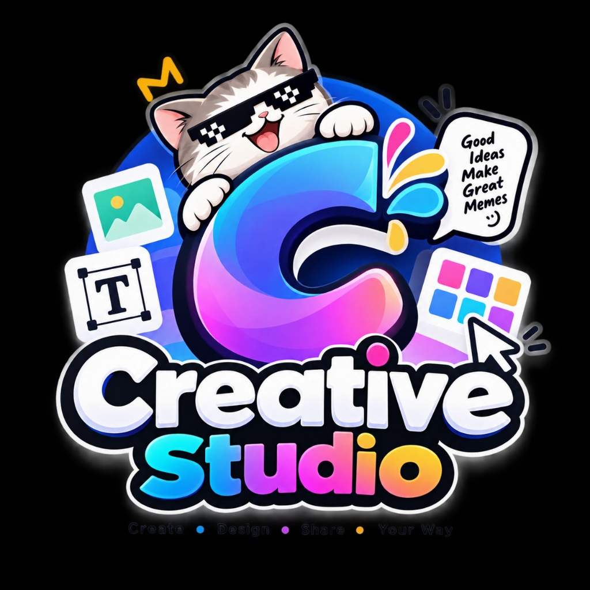

# Memeify 🎨🕶️

> **Modern, Clean & Intuitive Meme & Poster Generator Web App**  
> Create, customize, and export viral memes and posters directly in your browser.



---

## ✨ Features

- 🖼️ **Authentic Built-in Templates**:
  - *Drake Hotline Bling*
  - *Two Buttons / Daily Struggle*
  - *Distracted Boyfriend*
  - *Left Exit 12 (Drifting Car)*
  - *Gru's Plan*
- 📤 **Custom Image Upload**: Drag & drop any PNG, JPG, or WebP image.
- 📐 **Aspect Ratio Presets**: Original, 1:1 Square, 4:5 Instagram, 16:9 Landscape, 9:16 Story/Reels.
- ✍️ **Advanced Typography & Text Layers**:
  - Free canvas dragging with interactive selection bounding box
  - Classic meme fonts (*Impact*, *Montserrat*, *Space Grotesk*, *Arial*, etc.)
  - Text outline stroke with custom width & color
  - Preset color swatches + color picker
  - One-click `ALL CAPS` toggle, alignment, drop shadows, and opacity
- 🕶️ **Meme Emojis & Stickers**:
  - Curated meme emojis (😂, 💀, 🔥, 🤡, 🕶️, 👑, 💯, 🗿, etc.)
  - Vector meme badges (Thug Life pixel sunglasses, Golden Crown, WASTED badge, Memeify Mascot)
  - 360° rotation, scale slider, and horizontal flip (`↔️ Flip`)
- 🎨 **Visual Effects & Image Filters**:
  - Grayscale, Brightness, Contrast, Blur, Sepia, Saturation, Invert
  - One-click presets: *B&W Dramatic*, *Vintage*, *Cyberpunk*, *Invert*, *Reset*
- 📑 **Layer Management Stack**:
  - Reorder layers up/down, send to front/back
  - Toggle visibility or delete individual layers
- ↩️ **Undo / Redo History Engine**:
  - State snapshot stack with keyboard shortcuts (`Ctrl+Z` / `Ctrl+Y`)
- 💾 **Multi-Format Export & Local Storage**:
  - High-resolution **PNG** (lossless)
  - Web-optimized **JPEG**
  - Printable **PDF Document** via `jsPDF`
  - **My Memes** gallery saved to browser `localStorage`

---

## 🚀 Getting Started

### Prerequisites
- [Node.js](https://nodejs.org/) (v18 or higher recommended)
- `npm`

### Installation
```bash
# Clone the repository
git clone https://github.com/ZENCalbee-010/memeify.git

# Navigate to project directory
cd memeify

# Install dependencies
npm install

# Start development server
npm run dev
```

Open your browser and navigate to `http://localhost:5173/`.

### Run Tests
```bash
npm test
```

### Build for Production
```bash
npm run build
```

---

## 🛠️ Technology Stack
- **Core**: Vanilla JavaScript (ES Modules), HTML5 `<canvas>` API
- **Styling**: Vanilla CSS (Modern dark slate theme, responsive layout, fluid micro-interactions)
- **Icons**: Lucide Icons
- **PDF Generation**: `jspdf`
- **Build Tool**: Vite
- **Testing**: Vitest with Happy-DOM

---

## 🌿 Incremental Git Branching Workflow
This project was developed strictly adhering to feature-by-feature branches, validated through automated unit tests before merging into `main`:

| Branch | Feature Description | Status | Tests |
| :--- | :--- | :---: | :---: |
| `feat/01-core-canvas-templates` | Canvas rendering engine, templates catalog, aspect ratio presets | **Merged** | 6 / 6 |
| `feat/02-text-layers-styling` | Text layers, interactive canvas dragging, rich typography, outlines | **Merged** | 11 / 11 |
| `feat/03-stickers-and-emojis` | Emojis & vector stickers, rotation, scale, flip, custom sticker upload | **Merged** | 15 / 15 |
| `feat/04-layer-management-filters` | Layer management stack and image visual effect filters | **Merged** | 19 / 19 |
| `feat/05-undo-redo-and-export` | Undo/redo engine, PNG/JPEG/PDF export, LocalStorage gallery | **Merged** | 22 / 22 |
| `feat/06-human-designed-ui-polish` | Human-crafted UI redesign with calm dark palette and vector icons | **Merged** | 22 / 22 |
| `feat/07-rebrand-to-memeify` | Rebrand to Memeify, document metadata & storage keys | **Merged** | 22 / 22 |
| `feat/08-authentic-meme-templates` | Authentic user-provided high-res meme images | **Merged** | 22 / 22 |
| `feat/09-logo-branding` | Official mascot logo, favicon, and sticker badge | **Merged** | 22 / 22 |
| `chore/cleanup-unused-files` | Remove unused boilerplate and redundant asset files | **Merged** | 22 / 22 |
| `docs/readme-documentation` | Comprehensive project documentation & guide | **Merged** | 22 / 22 |

---

## 📄 License
MIT License. Feel free to use, modify, and build upon it!
